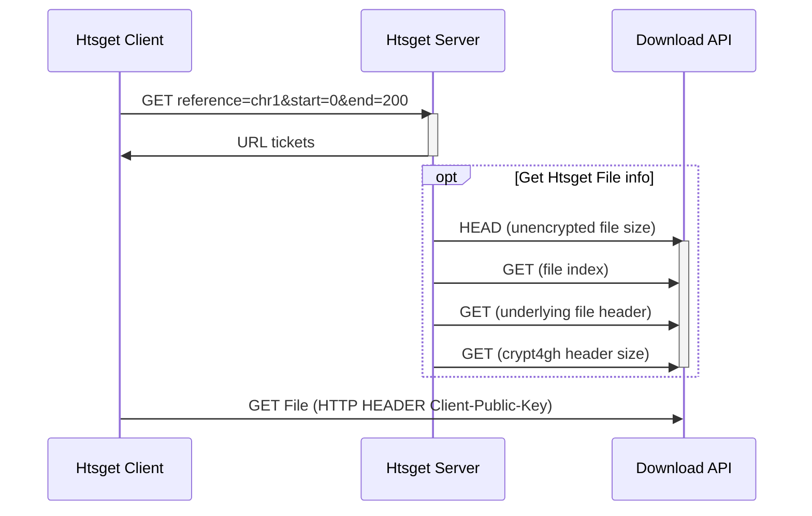

# Introduction

The European Genome-phenome Archive (EGA) [@EGA] and it's extension the
Federated EGA (FEGA) (@FEGA) are services for archiving and sharing personally
identifiable genetic and phenotypic data, while The Genomic Data Infrastructure
(GDI) [@GDI] project is enabling secondary use of genomic and phenotypic
clinical data across Europe. Both projects are focused on creating federated
and secure infrastructure for researchers to archive and share data with the
research community, to support further research. In the nordics we collaborate
on a sofware suite under the NeIC umbrella called the Sensitive Data Archive
[@ref] to support these efforts.

(work it in Nordic e-Infrastructure Collaboration(NeIC) [@NEIC].)


This project was focused on the data access part of the infrastructure. The
files are encrypted in the archives, using the crypt4gh standard [@crypt4gh].
Currently, we have a data access processes, where the files are either
decrypted on the server side and then transferred to the user or re-encrypted
server-side with the users public key and provided to the user in a dedicated
outbox. This process is cumbersome and requires a lot of manual intervention by
the archive operators. It's also not very granular, for example, in the case a
user only wants access to just a small region of the genomic files we still
provide the full reencrypted dataset, which is expensive in both human and
computational resources.


Htsget [@htsget] as a data access protocol allows access to parts of files.
Before the Biohackathon event, there were no htsget servers that supported
partial access to encrypted data. Our goal of the project was to extend the
htsget-rs [@htsget-rs] Rust server and integrate it into the GDI starter kit to
support GA4GH Passport authorized, re-encrypted access to partial files.


We also aimed to extend already existing client tools so they can access
encrypted data over the htsget protocol using GA4GH Passport and Visa standard,
which enhances the security of the data access interfaces.


# Results


## HTSGet


In order to enable for random data access on encrypted files, we worked on
extending htsget-rs [@htsget-rs] to work with the sda-download part of the NeIC
nordic sensitive data archiving suite. We developed the following sequence
diagram for interactions between the server softwares. Basically it means the
client first communicates with the Rust server to get information on what to
download, which it then downloads from the sda-download service.





## Extend sda-download to support re-encryption


We also extended the sda-download service to support re-encryption of
requested files. This so the user can get files encrypted with their own
keypair instead of just plain unencrypted files. Since we don't want to keep
the archive secret key in a service that is available directly from the
internet we have implemented a small microservice (gRPC Server in the diagram)
that recieves the encrypted header and a public key and re-encrypts and sends
it back.


 ```mermaid
sequenceDiagram
    client->>sda-download: HTTP Header: Crypt4gh-Public-Key
    activate sda-download
    sda-download->>gRPC Server: Request: OldHeader, PublicKey
    activate gRPC Server
    gRPC Server->>sda-download: NewHeader
    deactivate gRPC Server
    sda-download->>client: encrypted Data
    deactivate sda-download
 ```


## Bits and bobs


 * Updated the htsget starter-kit to use the htsget-rs
 * Enhanced sda-cli with a htsget command
 * Drank lots of coffee
 * Found and fixed a bunch of bugs.
 * Started implementing native support for crypt4gh in htsget-rs


# Future work


 * Fully implement crypt4gh in htsget-rs
 * Enable support for crypt4gh edit lists
 * Authenticating requests/tickets, so the download service can trust that a
   request came from the htsget-rs service
 * Remove unnecesarry bytes
 * Showcase reading an encrypted file over the htsget protocol.


# GitHub repositories

* [GenomicDataInfrastructure/starter-kit-storage-and-interfaces](https://github.com/GenomicDataInfrastructure/starter-kit-storage-and-interfaces)
* [GenomicDataInfrastructure/starter-kit-htsget](https://github.com/GenomicDataInfrastructure/starer-kit-htsget)
* [umccr/htsget-rs](https://github.com/umccr/htsget-rs)
* [neicnordic/sda-download](https://github.com/neicnordic/sda-download)
* [neicnordic/sensitive-data-archive](https://github.com/neicnordic/sensitive-data-archive)
* [NBISweden/sda-cli](https://github.com/NBISweden/sda-cli)


# Acknowledgements
TODO Copy from last paper
Please always remember to acknowledge the BioHackathon, CodeFest, VoCamp, Sprint or similar where this work was (partially) developed.

# References

Leave thise section blank, create a paper.bib with all your references.
